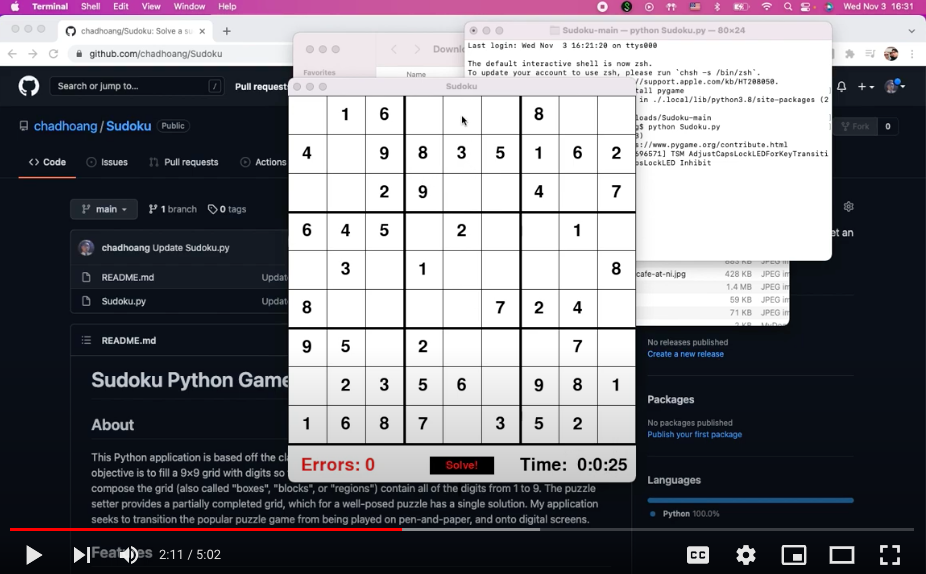

# Sudoku Python Game
## About
This Python application is based off the classic Japanese logic-based puzzle, Sudoku.  In classic sudoku, the objective is to fill a 9×9 grid with digits so that each column, each row, and each of the nine 3×3 subgrids that compose the grid (also called "boxes", "blocks", or "regions") contain all of the digits from 1 to 9. The puzzle setter provides a partially completed grid, which for a well-posed puzzle has a single solution. My application seeks to transition the popular puzzle game from being played on pen-and-paper, and onto digital screens.

## Demo
[](https://youtu.be/DnhbtKAeGYk)

## Features
- Random Board Generation -- number values and their placement location are randomized so that starting a new game will bring a unique puzzle experience each time.
- Difficulty Customization - adjusting the difficulty setting will affect the number of completed cells you start with in when starting a new Sudoku puzzle. Difficulties include:
	1. Easy (Start with 45 completed cells)
	2. Medium (Start with 35 completed cells)
	3. Hard (Start with 25 completed cells)
	4. Custom (Choose to start with 0-81 completed cells)
- Timer - keeps track of the amount of time spent on a puzzle
- Error counter - tracks the number of errors made
- **Solve!** button - automatically solves the puzzle for you using a recursive backtracking algorithm
- Sleek and simple graphical user interface (GUI)

## How To Use
To use the application, download the `Sudoku.py` file onto your computer. The application also requires that you install Python (link: https://www.python.org/downloads/) and Pygame (link: https://www.pygame.org/wiki/GettingStarted) onto your device.
```
pip install pygame
```
Once the files are installed and placed into the proper locations, run the `Sudoku.py` file to play. A way that you can run a python file is by using your computer's terminal, where you change directories to where the `Sudoku.py` file is located, then enter
```
python Sudoku.py
```

## Lessons Learned
This project was a great way to refresh myself with all the python coding skills that I had first developed during my first two years of college. I feel that I am much more familiar with Python syntax once again, and that I can work much more productively with the language in a fast-paced environment. My skills with Object-Oriented Programming have also been refreshed, as I had to work with classes for the Sudoku puzzle grid, along with creating a class to represent the cells of the grid. My algorithmic knowledge has also been strengthened by working with the recursive backtracking algorithm in this project. This was the main algorithm used in this project to determine if an input was correct or not, and also used to automatically solve the puzzle. An article about the algorithm can be read about here: https://www.geeksforgeeks.org/backtracking-introduction/#:~:text=Backtracking%20is%20an%20algorithmic%2Dtechnique,reaching%20any%20level%20of%20the

In this project, I had to work with a python module that I was completely unfamiliar with called Pygame. With this project, I had to adapt quickly to the all functionalities that this module had to offer, and utilize them well in order to create a complete product at the end that not only looks great visually, but also operates efficiently.
 
I also learned about being in control of design elements and feature implementations from this project. I started out with setting goals of features of what I wanted to implement within this Sudoku game, which included all the features I had mentioned earlier in this README such as random board generation or an automatic solver. It felt great to see these features that I set out to include into the program make it into implementation at the end, and that the purposes of the features do help to enhance the user's experience with their inclusion, as I can attest to through my own rigorous testing of the program. Also, the inclusion and design of a main menu and other screens besides just the Sudoku puzzle screen helped showcase by ability to design a product that looks pleasing to the user, and helps to create a more complete experience overall. It felt great to visualize a product that I would desire as a user/consumer, and to go out and actually work to actualize that product as a creator.
